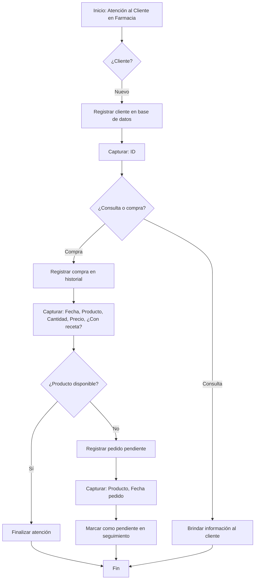

# Diagrama de Atención al Cliente en Farmacia

```mermaid
flowchart TD
    A[Inicio: Atención al Cliente en Farmacia] --> B{¿Cliente?}

    B -- Nuevo --> C[Registrar cliente en base de datos]
    C --> D[Capturar: ID]
    D --> F{¿Consulta o compra?}

    F -- Consulta --> G[Brindar información al cliente]

    F -- Compra --> H[Registrar compra en historial]
    H --> I[Capturar: Fecha, Producto, Cantidad, Precio, ¿Con receta?]

    I --> J{¿Producto disponible?}

    J -- Sí --> K[Finalizar atención]

    J -- No --> L[Registrar pedido pendiente]
    L --> M[Capturar: Producto, Fecha pedido]
    M --> N[Marcar como pendiente en seguimiento]

    K --> O[Fin]
    N --> O
    G --> O

```
